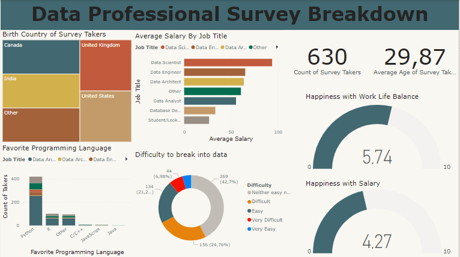

# Data Professional Survey Data Visualization with PowerBi : Project Overview

It's a pure Power Bi Project created to make a dashboard of a survey made for employees who work in data related fields. This project consists of a data wrangling process within Power Bi desktop to get our data in the best format to use to make a final dashboard.

## Data Cleaning

* Divided yearly salary range column into minimum, maximum and average salaries as numbers to be able to use them within our dashboard.
* Minimized the number of categories available within programming language, current data role, living country options to help us in the data visualization process.
* Made the necessary changes regarding data types of all variables that needed to be updated.

## Data Visualization

We made a dashboard after we completed the data cleaning operation on our data which consists of :
* At the beginning, we made 2 statistics to give stakeholders and non technical users of this dashboard a general idea on the whole project and data by extracting the count of our survey takers and their average age.
* The first chart showed the distribution of birth country for all survey takers to put that into consideration when we see the variation of salaries.
* The second plot emphasized the variation of the mean salary by job title.
* The third figure declared the count of survey participants for each programming language they prefer and use in their work broke down by their job title.
* The fourth picture presented the variation of the difficulty to break into data field among all samples.
* The fifth and sixth images explained us the average happiness with work balance and salary among all participants in our real life survey.

<b> 

